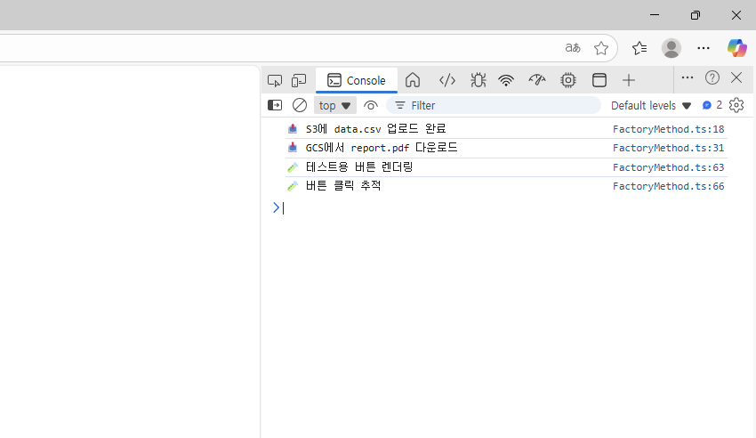
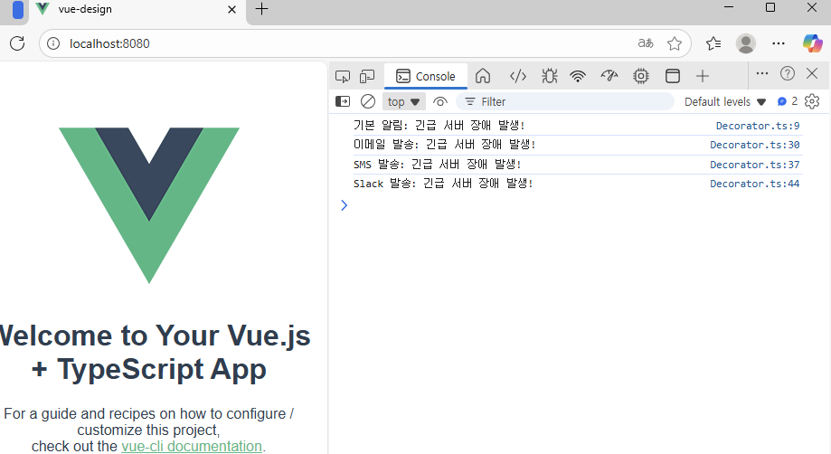
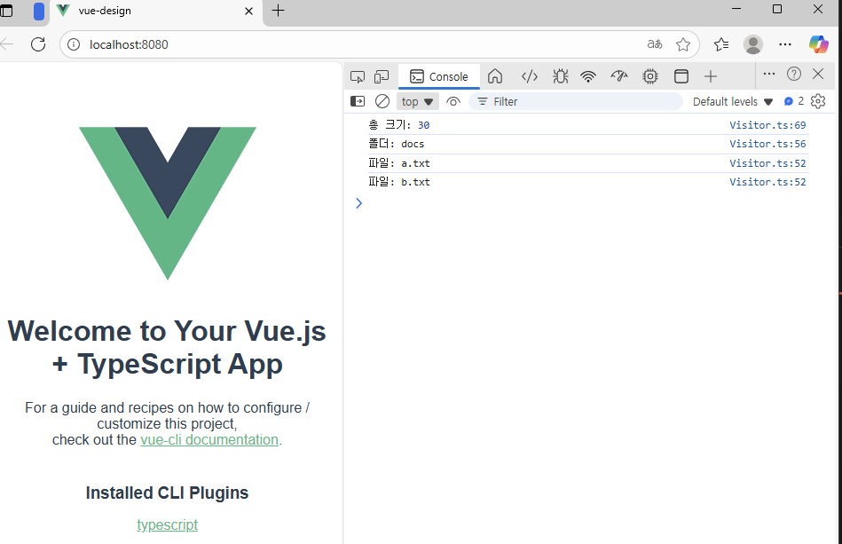

# 🎨 Vue + TypeScript 디자인 패턴 실습 프로젝트

## 🧾 프로젝트 개요
이 프로젝트는 Vue 3 + TypeScript 환경에서  
GoF의 대표적인 디자인 패턴 9가지를 직접 구현하고 콘솔 결과를 검증한 실습 과제입니다.

---

## 🧩 1. 구현된 패턴 목록

| 분류 | 패턴명 | 파일명 | 실행 함수 |
|------|--------|--------|------------|
| 생성 패턴 | Singleton | `Singleton.ts` | `runSingletonExample()` |
| 생성 패턴 | Factory Method | `FactoryMethod.ts` | `runFactoryMethodExample()` |
| 구조 패턴 | Adapter | `Adaptor.ts` | `runAdaptorExample()` |
| 구조 패턴 | Decorator | `Decorator.ts` | `runDecoratorExample()` |
| 행위 패턴 | Observer | `Observer.ts` | `runObserverExample()` |
| 행위 패턴 | Visitor | `Visitor.ts` | `runVisitorExample()` |
| 생성 패턴 | Builder | `Builder.ts` | `runBuilderExample()` |
| 구조 패턴 | Bridge | `Bridge.ts` | `runBridgeExample()` |
| 행위 패턴 | Strategy | `Strategy.ts` | `runStrategyExample()` |

---

## 📸 2. 주요 패턴 소개 (1~6번)

### 🔹 (1) Singleton Pattern
**하나의 인스턴스만 존재하도록 보장하는 패턴.**  
데이터베이스 연결, 설정 객체 등에 자주 사용됨.  

---

### 🔹 (2) Factory Method Pattern
**객체 생성을 서브클래스에서 결정하는 패턴.**  
새 Logger나 Storage를 추가해도 클라이언트 코드 변경 없이 확장 가능.  


---

### 🔹 (3) Adapter Pattern
**호환되지 않는 인터페이스를 연결해주는 중간 어댑터 역할.**  
기존 `OldPaymentProcessor`와 새 `NewPaymentGateway`를 연결.  


---

### 🔹 (4) Decorator Pattern
**기존 객체에 기능을 동적으로 추가.**  
기본 알림 → 이메일 → SMS → Slack 발송 순으로 기능 확장.  

---

### 🔹 (5) Observer Pattern
**주체(Subject)의 상태 변화를 관찰자(Observer)들이 감지.**  
주가가 변경될 때 자동으로 알림을 보내는 구조.  


---

### 🔹 (6) Visitor Pattern
**데이터 구조를 변경하지 않고 새로운 동작(연산)을 추가.**  
파일과 폴더 구조를 순회하며 크기 계산 및 이름 출력.  


---

## 💻 3. 실습 구현 과제 (7~9번)

> 아래 3개 패턴은 직접 구현 과제로 수행한 내용으로,  
> 콘솔 기반 테스트를 통해 정상 동작을 확인하였습니다.

### 🧱 (7) Builder Pattern — 생성 패턴
- 복잡한 객체(예: Computer)를 단계적으로 생성.
- `Director`를 통해 구성 순서를 통제.
- 코드: `src/utils/Builder.ts`

---

### 🧩 (8) Bridge Pattern — 구조 패턴
- 기능 계층(`Shape`)과 구현 계층(`Color`)을 분리.
- 서로 독립적으로 확장 가능.
- 코드: `src/utils/Bridge.ts`

---

### 🧠 (9) Strategy Pattern — 행위 패턴
- 결제 방식(카드, PayPal, 암호화폐)을 런타임에 교체.
- Context(`PaymentContext`)가 전략(`PaymentStrategy`)을 실행.
- 코드: `src/utils/Strategy.ts`

---

**🔍 실행 결과**
- Builder, Bridge, Strategy 실행결과(한 번에 실행)


---

## ⚙️ 4. 실행 방법

```bash
npm install
npm run serve
